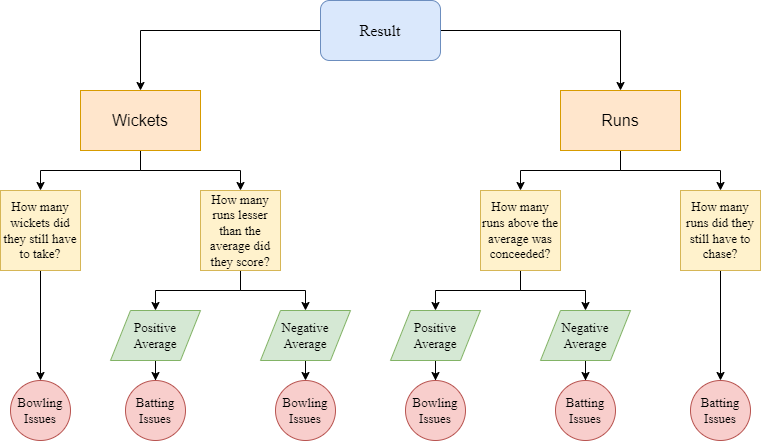
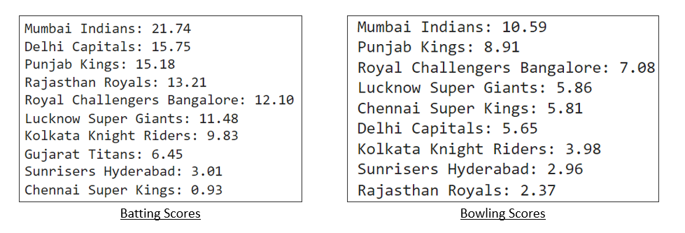
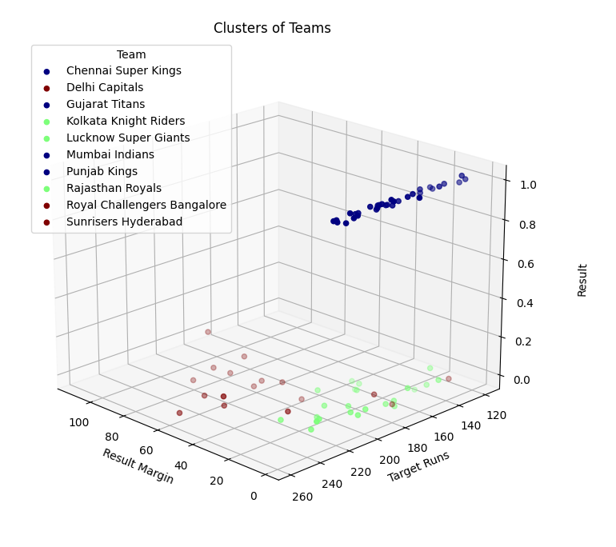

Built a scoring algorithm to quantify individual team requirements using IPL match data, visualised analytical results, and applied K-means clustering to group teams based on batting and bowling deficiencies for data-driven auction strategies.

## Scoring Algorithm for Determining In-Depth Team Requirements
This diagram illustrates the weighted scoring algorithm used to assess each team's strengths and deficiencies across batting and bowlings.

## Analytical Approach Results
This visualisation shows the analytical scoring results for each team, breaking down performance requirements and highlighting gaps to inform data-backed player acquisition.

## K-Means Clustering Results
K-means clustering was applied to group teams based on their batting and bowling deficiencies, revealing performance-based clusters that support smarter auction strategies.

