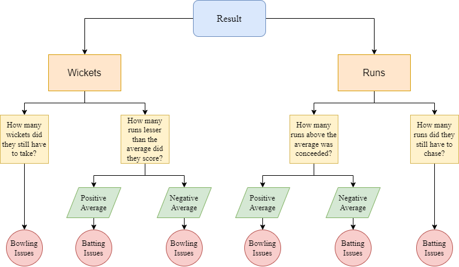
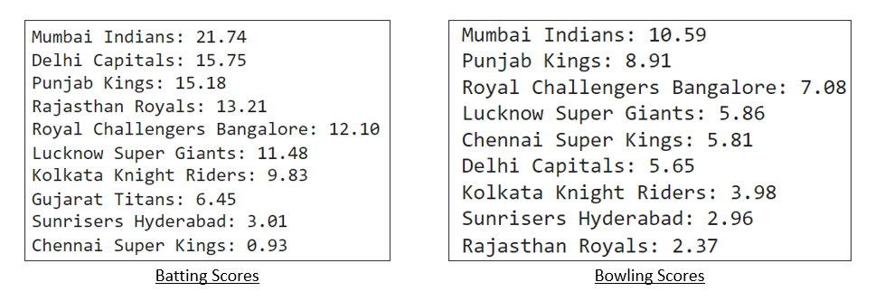
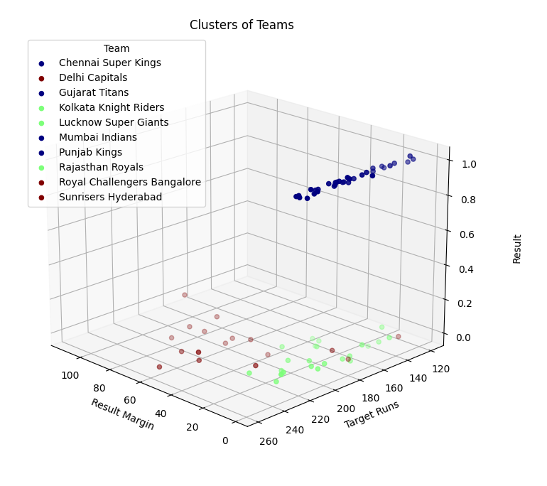
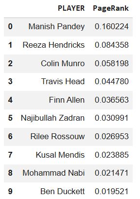
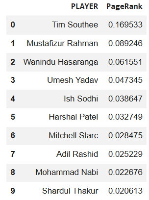
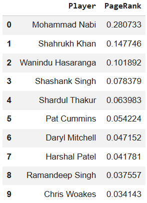

# 🏏 IPL Auction Simulation using Data-Driven Strategies  

This project simulates IPL auction dynamics using data-driven techniques by analysing team weaknesses, clustering similar teams, and recommending optimal player targets.

We combine scoring algorithms, clustering, and a PageRank-based ranking system to model realistic auction strategies and competition between teams.

---

## Overview  

- Quantified team-specific requirements using historical IPL match data  
- Applied K-Means clustering to group teams with similar weaknesses  
- Developed a PageRank-based player scoring system to recommend top player targets  
- Simulated auction competition by identifying teams targeting similar players  

---

## Scoring Algorithm for Team Requirements  

A weighted scoring algorithm was designed to evaluate each team's batting and bowling strengths and deficiencies.

---

## Analytical Results  

The scoring outputs are visualised to highlight performance gaps across teams, enabling data-backed player acquisition strategies.

---

## K-Means Clustering of Teams  

Teams are grouped using K-Means clustering based on their batting and bowling deficiencies.

This reveals clusters of teams with similar requirements, which is crucial for understanding auction dynamics.

### Key Insight  
Teams within the same cluster are likely to target similar player profiles, leading to bidding competition.

For example:  
- Chennai Super Kings (CSK)  
- Mumbai Indians (MI)  
- Punjab Kings (PBKS)  

These teams fall into the same cluster, indicating overlapping squad needs and potential auction clashes.

---

## Player Recommendation using PageRank  

To enhance decision-making, we introduce a PageRank-inspired scoring algorithm to rank players based on:

- Performance impact  
- Consistency  
- Relevance to team requirements  

Players are categorised into:
- Batsmen  
- Bowlers  
- All-rounders  

---

## Top Player Targets  

The following figures showcase the top recommended players for each category:

### Figure 6: Top Batsmen  

### Figure 7: Top Bowlers  

### Figure 8: Top All-Rounders  

---

## Strategic Auction Insights  

By combining team requirement scores, clustering, and player rankings, we can simulate realistic auction behaviour:

- Teams with similar deficiencies compete for the same players  
- High-ranked players attract multi-team bidding wars  
- Teams prioritise players based on squad balance needs  

Example:  
Sunrisers Hyderabad (SRH) show relatively low batting and bowling scores from the scoring algorithm.  

As a result, they are more likely to prioritise all-rounders, as reflected in Figure 8.

---

## Key Takeaways  

- Data-driven approach to model IPL auction strategies  
- Combines machine learning (K-Means) with graph-based ranking (PageRank)  
- Identifies team needs, player targets, and inter-team competition  
- Simulates realistic auction dynamics  

---

## Tech Stack  

- Python  
- Pandas, NumPy  
- Scikit-learn  
- NetworkX  
- Matplotlib, Seaborn  
